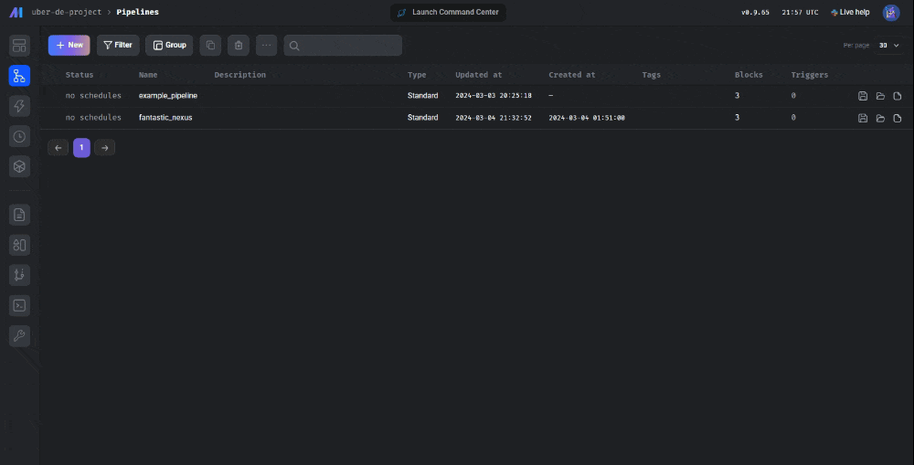
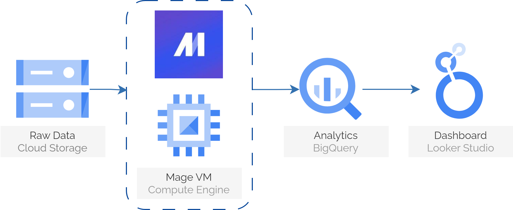
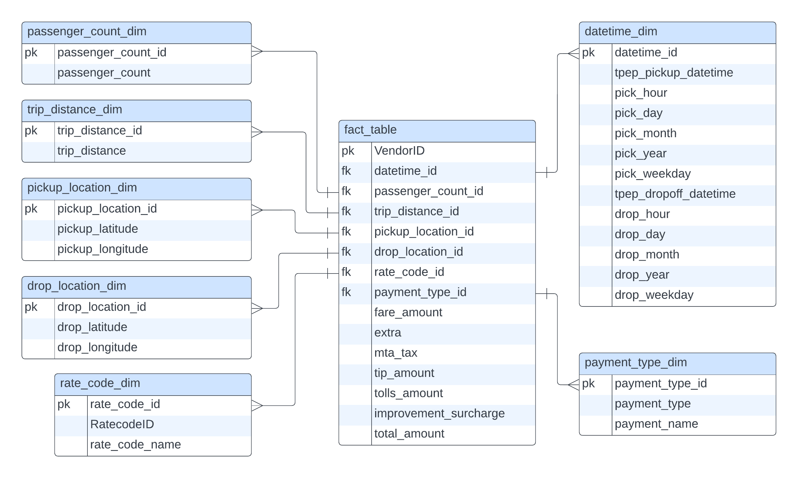
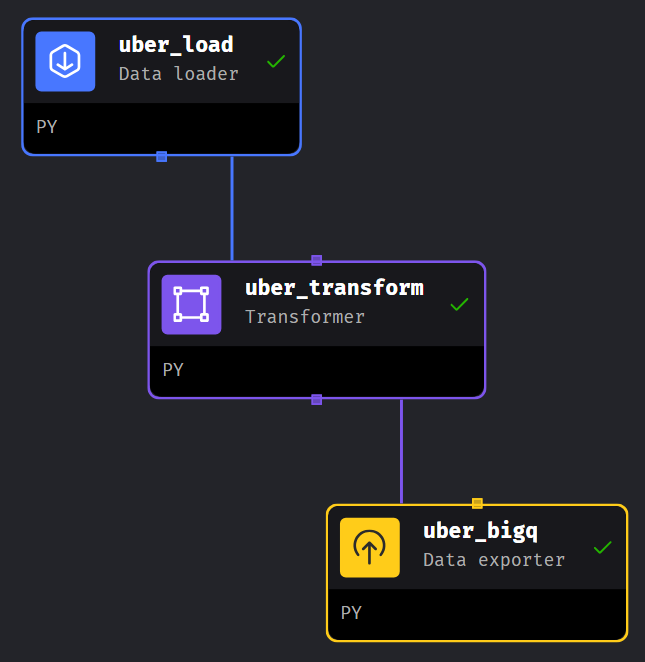
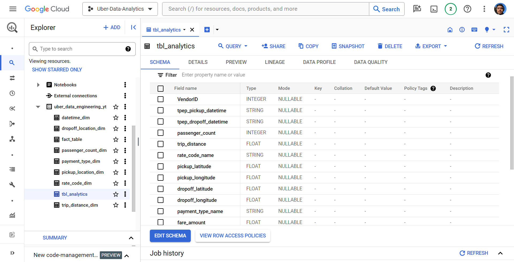
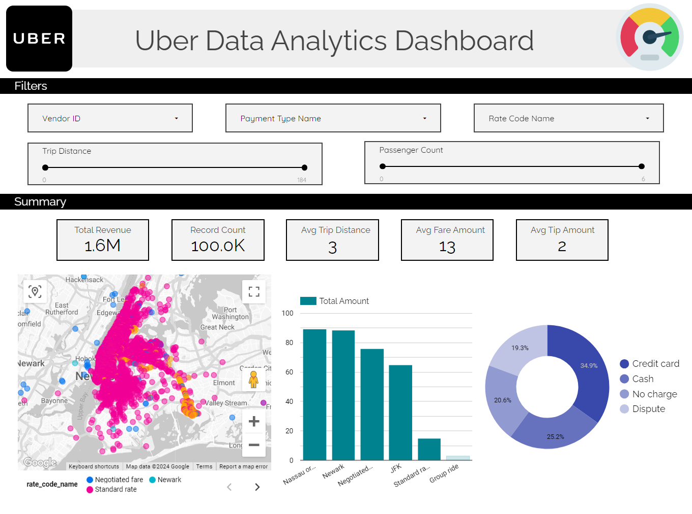

# NYC Taxi Trips Data Analysis with Google Cloud Platform 🚕

<a href="https://lookerstudio.google.com/s/m2NGxVQlv5k"></a>

## 🚀 Introduction
This project showcases a comprehensive data engineering pipeline using Google Cloud Platform (GCP) for analyzing taxi trips data from New York City. The pipeline includes steps such as data collection, storage setup, ETL processing, database creation, and data visualization.



## 🏗 Architecture
<p align="center">
    
</p>

## 📅 Dataset Used
TLC Trip Record Data
Yellow and green taxi trip records include fields capturing pick-up and drop-off dates/times, pick-up and drop-off locations, trip distances, itemized fares, rate types, payment types, and driver-reported passenger counts. 
- The data for May 2023 was chosen for this project.
- The dataset contains 100,000 rows and 19 columns.

More info about the dataset can be found here:
1. Website - https://www.nyc.gov/site/tlc/about/tlc-trip-record-data.page
2. Data Dictionary - https://www.nyc.gov/assets/tlc/downloads/pdf/data_dictionary_trip_records_yellow.pdf

## ⚙ Technology Stack

- **Google Cloud Platform (GCP)**: Infrastructure as a Service (IaaS) platform for hosting & managing the data engineering pipeline.
- **Python**: Programming language used for scripting and data manipulation tasks.
- **Google Compute Engine**: Provides virtual machines for running data processing tasks efficiently.
- **Google Cloud Storage**: Object storage service for storing and managing the raw data securely.
- [**Mage**](https://www.mage.ai/): Modern data engineering pipeline tool for Extract, Load, and Transform (ETL) processes.
- **Google BigQuery**: Fully managed data warehouse for storing and querying large-scale datasets.
- **Looker Studio**: Business intelligence platform for data visualization and dashboarding.

## 👨‍💻 Overview

The project follows these key steps:
### Data Modeling:
- Designs a data model for ensuring data integrity and consistency, facilitating better understanding and manipulation of the data.

**Fact Table Creation**: A fact table is created to store quantitative values for each trip, such as total cost, tip amount, etc.
Primary keys are assigned for unique identification.

**Dimension Tables Creation**: Dimension tables, including pickup location, dropoff location, passenger count, trip distance, date time, rate code type, and payment type, are created with appropriate foreign keys to establish relationships with the fact table.
<p align="center">
    
</p>

### Storage Setup on GCP:
- Creates a bucket storage on Google Cloud Platform to store the raw data, allowing for easy access and management.

### Virtual Machine Setup:
- Sets up a Compute Engine (VM) instance on GCP for running data processing tasks efficiently.
- Installs necessary packages and tools like Python, Git, and Mage.
```
sudo apt-get update -y

sudo apt-get install python3-distutils python3-apt wget -y

python3 -m venv myenv
source myenv/bin/activate

wget https://bootstrap.pypa.io/get-pip.py

sudo python3 get-pip.py

sudo pip3 install pandas

sudo pip3 install mage-ai

export GIT_PYTHON_REFRESH=quiet
mage start uber-de-project
```
If you are getting error, that might be cause PEP 668 updated that running pip as root user can result in broken permissions
- It is recommended to use a virtual env
- Make sure to enable Firewall port request under Network Interface on google console

<div style="text-align: right">
  
</div>

### ETL Process using Mage:
- Implements the Extract, Load, Transform (ETL) process using Mage, a modern data engineering pipeline tool. Transforms and loads the data into Google BigQuery for further analysis.

**1. Data Loader**: Loads data using cloud storage.

**2. Data Transformer**: Transforms the data according to the data modeling plan.

**3. Data Exporter**: Exports the transformed data to BigQuery by updating the `ioconfig.yml file`

### Google BigQuery:
- Creates tables in Google BigQuery to store transformed data.
- Executes SQL queries for analytics and creates additional tables for specific purposes.
<p align="center">
    
</p>

### Data Visualization with Looker Studio:
- Utilizes Looker Studio for visualizing the data stored in Google BigQuery.
- Creates interactive dashboards for exploring insights and trends.

<p align="center">
    
</p>
  
## 👋 Connect with Me
Let's connect and continue the conversation! Feel free to reach out to me via my socials below to share your thoughts, insights, and experiences with this modern GCP Data Engineering Pipeline. I look forward to connecting with fellow GCP enthusiasts and data engineering enthusiasts for ideas to improve this project! 

[](https://www.linkedin.com/in/sr099/) [](https://twitter.com/wtfisshivang)

---
*This project demonstrates a robust data engineering pipeline leveraging GCP services and modern data engineering tools to analyze and visualize taxi trips data effectively.*
